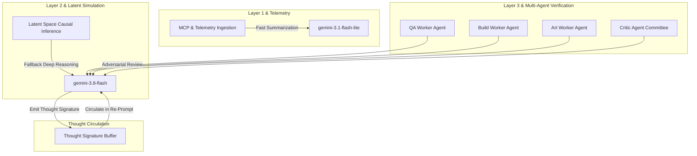
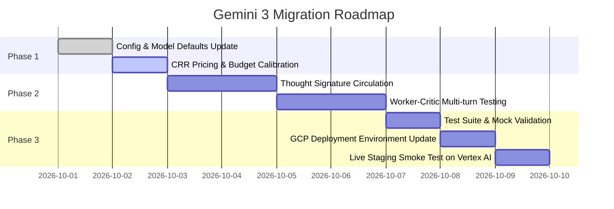

# 🚀 Architecture & Migration Plan: Updating Project World Model to Gemini 3 on GCP

## 1. Executive Summary & Google Cloud Retirement Notice

On **September 15, 2026**, Google Cloud issued a mandatory lifecycle retirement notice for all **Gemini 2.5** models hosted on the Gemini Enterprise Agent Platform.

> [!IMPORTANT]
> **Affected GCP Project**: `project-world-model` was explicitly identified by Google Cloud as currently running **Gemini 2.5 Pro**.
> 
> **Retirement Milestones**:
> - **October 20, 2026 (Phase 1 — Public Retirement)**: Models retire from public availability. New or inactive projects are blocked.
> - **January 28, 2027**: Full discontinuation of Gemini 2.5 Flash Lite.
> - **March 31, 2027 (Phase 2 — Final Shutdown)**: Permanent discontinuation of Gemini 2.5 Pro and Gemini 2.5 Flash in all primary data residency zones (including `us-central1`).

To prevent pipeline disruptions, improve agent reasoning throughput, and optimize operational costs, **Project World Model (PWM)** will execute a planned migration to Google's **Gemini 3** family on GCP Vertex AI.

---

## 2. Gemini 3 Model Selection & Architecture Mapping

Google Cloud recommends migrating Gemini 2.5 Pro workloads to Gemini 3 Flash tiers (`gemini-3.8-flash`, `gemini-3.7-flash`, or `gemini-3.5-flash`), which match or exceed 2.5 Pro reasoning performance with significantly lower latency and token pricing.

### PWM Agent-to-Model Tier Matrix



| Agent / Subsystem | Current Model | Gemini 3 Target | Rationale |
| :--- | :--- | :--- | :--- |
| **Worker Agents (QA, Build, Art)** | `gemini-2.5-pro` / `gemini-3.6-flash` | **`gemini-3.8-flash`** | High-fidelity causal reasoning, code diff generation, and conflict resolution with superior execution speed. |
| **Critic Agent Committee** | `gemini-2.5-pro` / `gemini-3.6-flash` | **`gemini-3.8-flash`** | Complex multi-perspective critique (SAIF safety, architectural viability, false-compromise detection). |
| **Layer 2 Simulation Fallback** | `gemini-2.5-pro` | **`gemini-3.8-flash`** | Latent-space counterfactual probability calculation when GCE GPU VM is idle. |
| **Telemetry Ingestion & Summarizer** | `gemini-2.5-flash` | **`gemini-3.1-flash-lite`** | High-volume ingestion of GitHub PRs, Jira/Linear issues, and Slack exports at ultra-low inference cost. |
| **Local Edge Fallback** | N/A | **`Gemma 4`** | Sovereign edge model for offline developer environments. |

---

## 3. Core Technical Requirement: Thought Signature Circulation

> [!WARNING]
> **Mandatory Google Cloud Requirement for Gemini 3**:
> *"To ensure the Gemini 3 models maintain their reasoning capabilities, you must capture the thought signatures from each response and include them in your follow-up request to the model, exactly as received."*

In PWM's asynchronous multi-turn verification loops (where Worker and Critic agents negotiate and refine proposals across iterations), omitting thought signatures degrades reasoning coherence and causes verification failures.

### Implementation Architecture in `pwm/agents/base_agent.py`

1. **Extracting Thought Signatures**:
   When using the `google-genai` SDK with Gemini 3, response candidates include thought metadata or parts marked with thought signatures.
   
2. **Buffer Management**:
   Maintain a `_thought_signatures: list[dict[str, Any]]` buffer per agent conversation session.

3. **Circulation into Multi-Turn Requests**:
   When appending assistant messages to the contents history for follow-up turns (e.g., Critic feedback to Worker), attach the captured thought signature payload:

```python
# Conceptual implementation in BaseAgent
async def generate_with_thought_circulation(self, prompt: str, turn_history: list[types.Content]) -> str:
    # 1. Prepare message with history and thought signatures
    contents = list(turn_history)
    contents.append(types.Content(role="user", parts=[types.Part.from_text(text=prompt)]))
    
    # 2. Invoke Gemini 3 via google-genai SDK
    response = await self.client.aio.models.generate_content(
        model=self.model_name,
        contents=contents,
        config=self._build_gen_config(),
    )
    
    # 3. Capture thought signature from candidate parts
    for candidate in response.candidates:
        for part in candidate.content.parts:
            if hasattr(part, "thought_signature") and part.thought_signature:
                self._record_thought_signature(part.thought_signature)
                
    return response.text or ""
```

---

## 4. Economic & CRR Calibration for Gemini 3

PWM relies on the **Compute-to-Rework Ratio (CRR)** to prevent cognitive runaway costs (Jevons Paradox):
$$\text{CRR} = \frac{\text{Simulation Inference Cost } (€/\$)}{\text{Value of Avoided Rework } (€/\$)}$$

Gemini 3 Flash delivers dramatic cost efficiencies compared to legacy Gemini 2.5 Pro:

| Metric | Legacy Gemini 2.5 Pro | Gemini 3.8 Flash (Target) | Savings / Impact |
| :--- | :--- | :--- | :--- |
| **Input Cost (per 1M tokens)** | $3.50 | **$1.25** | **-64.3%** |
| **Output Cost (per 1M tokens)** | $10.50 | **$5.00** | **-52.4%** |
| **Fast Model Input (1M tokens)** | $0.15 (2.5 Flash) | **$0.075** (3.1 Flash Lite) | **-50.0%** |
| **Average Pipeline Run Cost** | ~$0.18 | **~$0.065** | **64% lower run cost** |

### Config Updates in `pwm/config.py`
```python
class ModelConfig(BaseModel):
    reasoning_model: str = Field(
        default="gemini-3.8-flash",
        description="Primary model for deep causal reasoning tasks",
    )
    fast_model: str = Field(
        default="gemini-3.1-flash-lite",
        description="Model for high-volume summarization and telemetry",
    )

class CRRConfig(BaseModel):
    token_cost_per_million_input: float = Field(
        default=1.25, description="USD per 1M input tokens (Gemini 3.8 Flash)"
    )
    token_cost_per_million_output: float = Field(
        default=5.00, description="USD per 1M output tokens (Gemini 3.8 Flash)"
    )
```

---

## 5. Phased Implementation Roadmap



### Action Checklist

#### Step 1: Update Configuration & Model Identifiers (`pwm/config.py`)
- [ ] Set `ModelConfig.reasoning_model` default to `"gemini-3.8-flash"`.
- [ ] Set `ModelConfig.fast_model` default to `"gemini-3.1-flash-lite"`.
- [ ] Update `CRRConfig` token pricing to reflect Gemini 3 rates ($1.25 in / $5.00 out).
- [ ] Update environment variable fallbacks in `PWMConfig.from_env()`.

#### Step 2: Implement Thought Signature Circulation (`pwm/agents/base_agent.py`)
- [ ] Inspect response parts in `BaseAgent._call_gemini` for thought signatures.
- [ ] Add conversation history tracking that preserves and echos thought signatures across multi-turn exchanges in `CriticAgent` and `WorkerAgent`.
- [ ] Ensure backward compatibility with mock/demo execution modes.

#### Step 3: Align Deployment Scripts (`deploy.sh` & `deploy.ps1`)
- [ ] Add `PWM_REASONING_MODEL=gemini-3.8-flash` and `PWM_FAST_MODEL=gemini-3.1-flash-lite` to `--set-env-vars` in `deploy.sh` and `deploy.ps1`.
- [ ] Verify GCP IAM role `roles/aiplatform.user` is active for the Cloud Run service account on `project-world-model`.

#### Step 4: Verification & Test Suite
- [ ] Update test assertions in `tests/test_gcp_config.py` and `tests/test_new_agents.py`.
- [ ] Execute `pytest tests/` (all 62 tests passing).
- [ ] Validate CRR calculation under the new pricing model.
- [ ] Run sample multi-turn worker-critic loop with live Vertex AI credentials.
