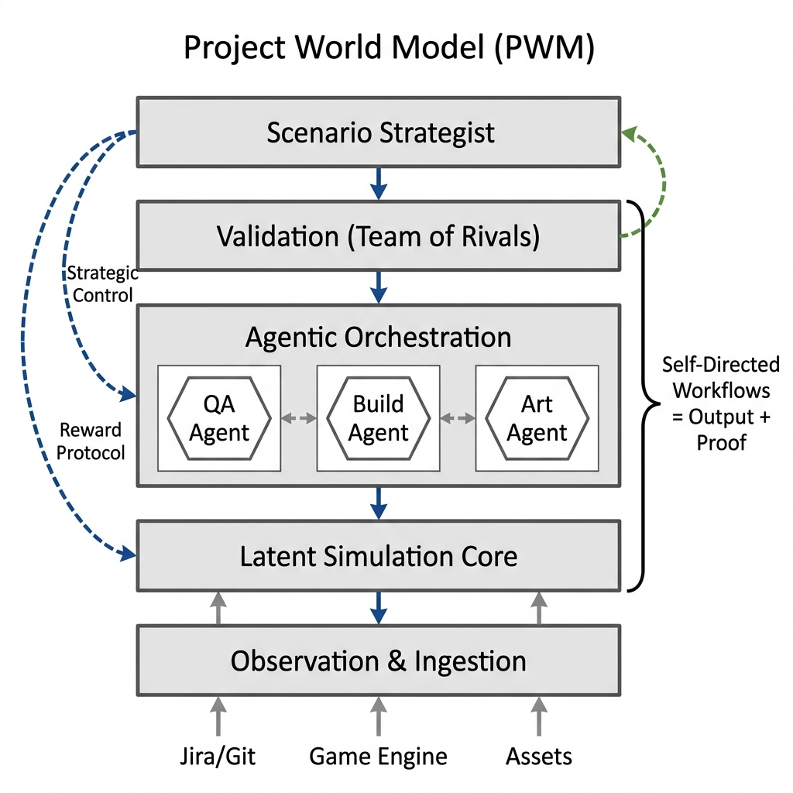

# Project World Model (PWM)

Eradicating integration debt via **Causal Digital Twins** and a 'Team of Rivals' simulation-driven architecture. Stop reacting, start predicting.

## Overview
The Project World Model (PWM) framework represents a fundamental paradigm shift in enterprise software engineering and complex production management. By evolving the technological infrastructure from reactive code generation tracking to predictive, latent-space causal simulation, the PWM structurally eradicates the "Paradox of Agility" and the crushing weight of integration debt.

## Gemini XPRIZE Submission Details
This project is entered in the **Build with Gemini XPRIZE Hackathon** under the **Small Business Services** and **Entrepreneurship & Job Creation** categories.
*   **The Mission**: Empower small business teams and startup founders to compete at AAA scale by automating integration, code validation, and QA.
*   **Google Cloud & Gemini Stack**: Deployed on **Google Cloud Platform** (Cloud Run, AlloyDB, BigQuery) and powered by the **Gemini API (via Vertex AI)** for multi-agent reasoning, latent-space causal simulation, and conflict resolution.
*   **AI-Native Operations**: The business is run entirely through AI-native operations where Gemini-powered worker and critic agents self-orchestrate task backlogs, run code validation playbooks, and manage the operational compute budget.

## Architecture

The PWM operates as a Causal Digital Twin, structured across 5 core layers:
1. **Layer 1: Observation & Ingestion**: Real-time telemetry ingestion using Model Context Protocol (MCP) integrations connecting JIRA, GitHub, Slack, and Google Cloud Data.
2. **Layer 2: Latent Simulation Core**: Deep causal reasoning predicting cascading integration failures in a computationally optimized latent space using Gemini.
3. **Layer 3: Agentic Orchestration**: Asynchronous parallel resolution streams powered by Gemini-based worker agents.
4. **Layer 4: Validation (Team of Rivals)**: An architectural firewall where Critic Agents audit Worker Agents to prevent pseudo-alignment and adversarial inputs before code reaches production.
5. **Layer 5: The Scenario Strategist**: The human-in-the-loop executive layer for setting objective functions, managing the intelligence budget, and maintaining absolute veto power.

## Value Proposition
- **Compute-to-Rework Ratio (CRR)**: Replaces slow, expensive human manual rework with hyper-fast cognitive computing power, providing clear business ROI.
- **Absolute Digital Sovereignty**: Secure, air-gapped on-premise enclaves utilizing NemoClaw and LingBot-World.
- **Ecological & Social Sustainability**: Eradicates crunch culture and mitigates GPU rendering waste.