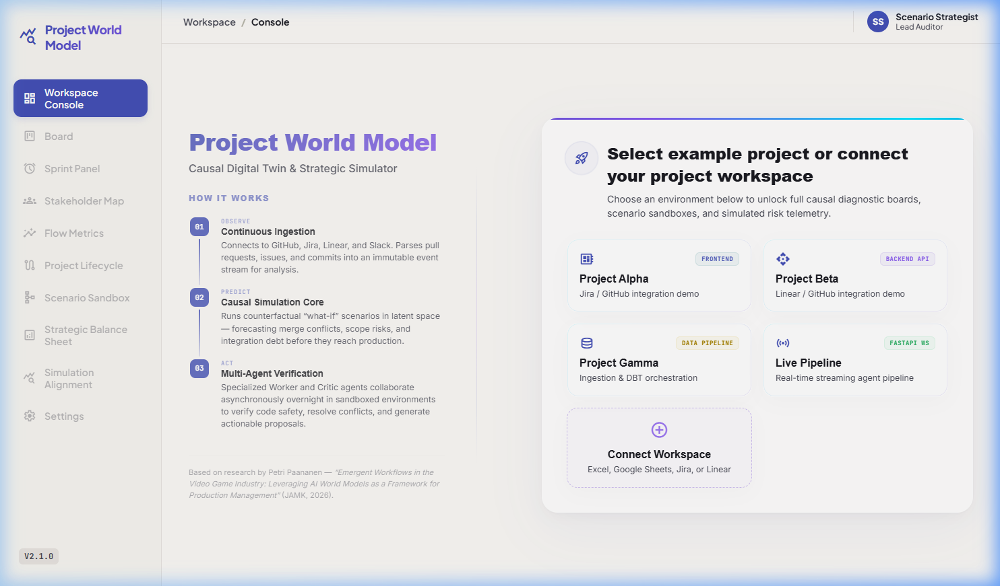
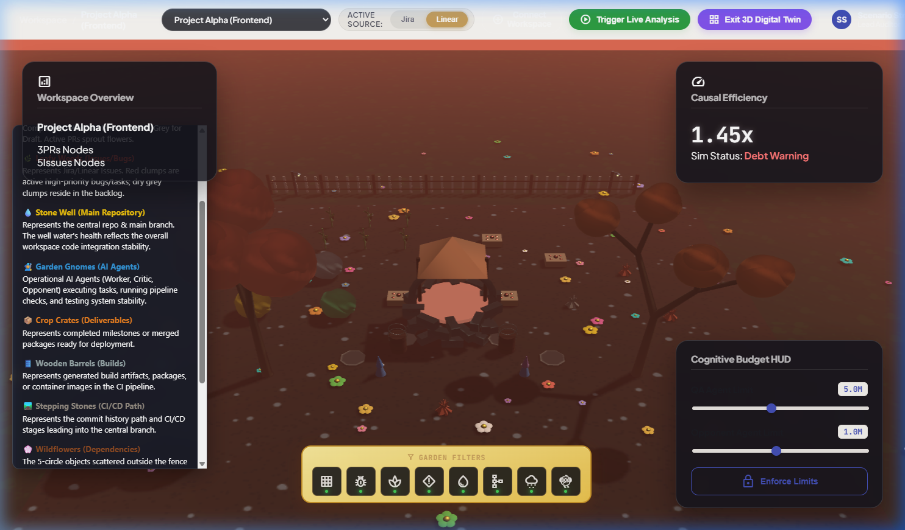
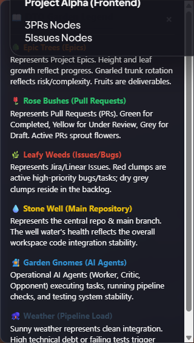
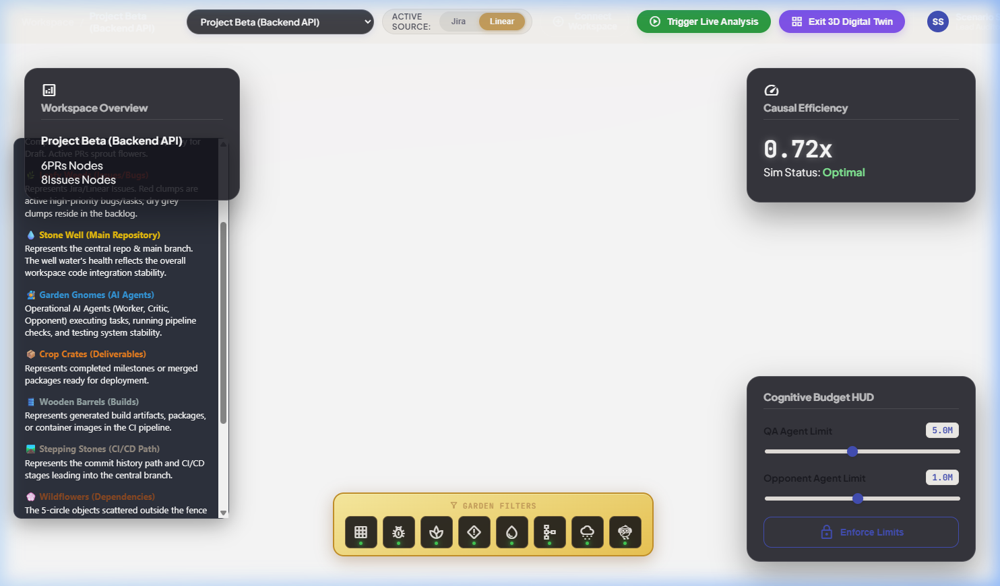
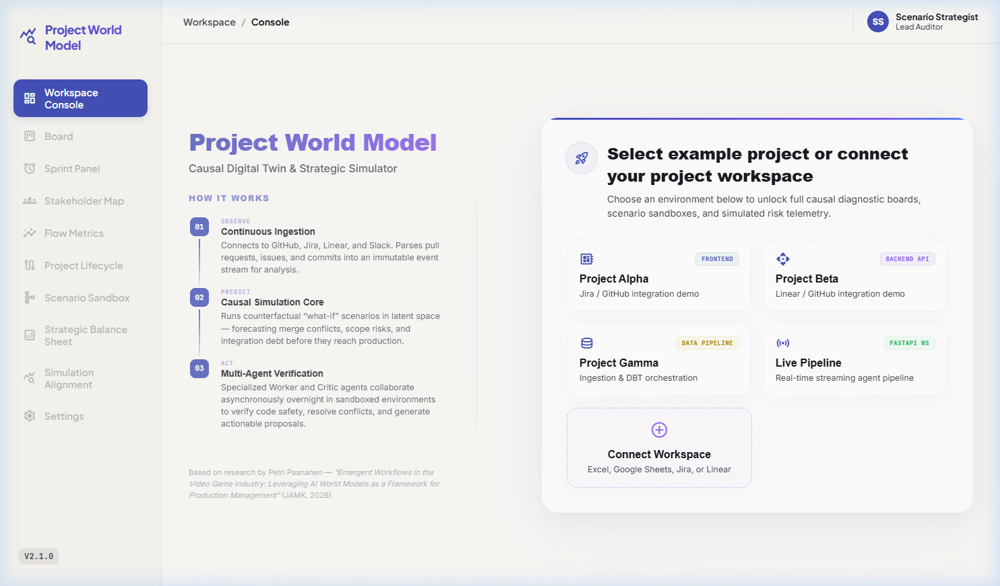
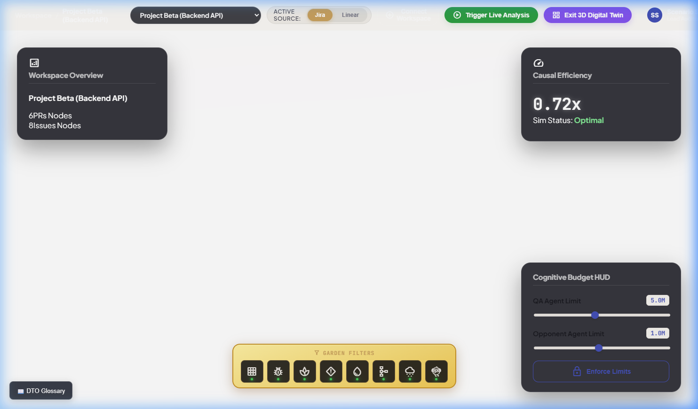
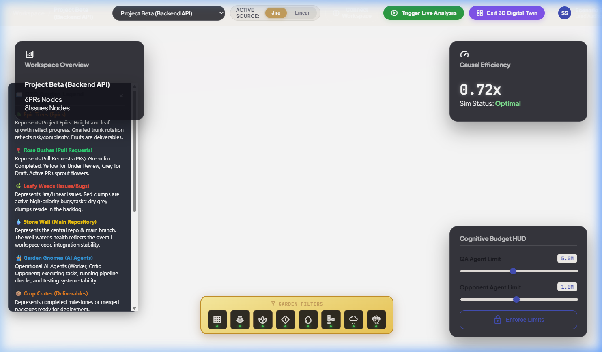

# Project World Model (PWM) — Product Walkthrough

Welcome to the **Project World Model (PWM)** interactive walkthrough. This document demonstrates the operational capabilities, architectural layers, and visual digital twin of the PWM framework.

---

## 🌍 The 3D Digital Twin Dashboard

The PWM dashboard bridges the gap between abstract software telemetry (commits, issue statuses, PR collisions) and a living 3D garden environment (built using **Babylon.js** for high performance). 

### 1. Unified Project Telemetry Overview
Upon launching the dashboard, the strategist is presented with a real-time summary of the repository state and sprint tracker metrics:



### 2. High-Fidelity 3D Classical Garden Viewport
By entering the **3D Digital Twin**, the project telemetry is dynamically rendered as a cozy, stylized garden. Every element in this viewport corresponds directly to codebase health:



*   **🌳 Epic Trees (Epics)**: Height reflects progress; trunk twist reflects complexity/risk.
*   **🌹 Rose Bushes (Pull Requests)**: Green flowers for completed PRs, yellow for in review, and grey for drafts.
*   **🌿 Leafy Weeds (Issues/Bugs)**: Red clumps represent active high-priority bugs; dry grey clumps denote backlog issues.
*   **💧 Stone Well (Main Repository)**: Water level and purity represent main branch stability.
*   **🧙 Garden Gnomes (AI Agents)**: Operational gnomes represent background Worker, Critic, and Opponent agents.
*   **📦 Crop Crates (Deliverables)**: Rendered dynamically near crop patches to represent completed milestones.
*   **🛢️ Wooden Barrels (Builds)**: Represents generated build artifacts or container images in the CI/CD pipeline.
*   **🛤️ Stepping Stones (CI/CD Path)**: Represents the commit history leading into the central branch.
*   **🚧 Fences (Workspace Scope)**: Defines branch boundary scopes.
*   **⛈️ Weather (Pipeline Load)**: High technical debt or failing tests trigger overcast skies and rain.

### 3. Contextual Mappings & Glossary
Strategic users can toggle the **Glossary overlay** to instantly identify which physical assets correspond to their agile delivery KPIs:



### 4. Multi-Project & Theme Swapping
The digital twin adapts its theme and crop profile based on the selected project:
*   **Project Alpha (Development)**: Sprout rows of tall corn crops and pumpkin crates.
*   **Project Beta (Staging)**: Sprout rows of orange carrots.
*   **Project Gamma (Production)**: Sprout cabbages and spiky weeds (bug representation).

Here is the staging/beta environment with carrot rows rendering dynamically:



---

## 🤖 Agent Verification Engine Logs

In the background, the **Worker** and **Critic** agents autonomously ingest telemetry, evaluate integration debt, and negotiate optimal resolution proposals. Below is a sample live log showing their continuous cycle:

```text
🌍 Deploying Async Agent Verification Engine...
Spawning Ingest Worker and Agent Worker tasks...

🌐 Web Dashboard: http://0.0.0.0:8765

[📡 Ingest Worker] Waking up to poll MCP servers...
[📡 Ingest Worker] Queued new state snapshot. Sleeping 60s.
[🤖 Agent Worker] Processing snapshot 5f6e6fde...
[🤖 Agent Worker] Layer 1 observation processed: status=raw_logs
[🤖 Agent Worker] [Grounding] Calibration error: 0.0456, weight factor adjusted to: 1.2476

┌─ 🔍 Integration Debt Analysis ──────────────────────────────────────────────┐
│ ⚠️ Detected 7 integration debt items (4 high, 3 medium). Estimated           │
│ total rework if unresolved: 44.0 developer-hours ($3,300).                  │
└─────────────────────────────────────────────────────────────────────────────┘

🤖 Proposals & Critic Verdicts

┌──────────────────────────────── Conflict #1 ────────────────────────────────┐
│ Resolving: File 'engine/renderer/shaders.glsl' is being modified by 2 open  │
│ PRs simultaneously...                                                       │
│   ★ Sequential Merge Strategy                                               │
│     Merge the involved PRs in dependency order to minimize conflict         │
│     surface. Start with the smallest changes.                               │
│     Effort: 2.4h | Risk: low                                                │
│                                                                             │
│ Critic Verdict: ✅ APPROVED                                                 │
│   Architectural Integrity: 85%                                              │
│   Strategic Dishonesty: ✓ None                                              │
│   Scope: appropriate                                                        │
└─────────────────────────────────────────────────────────────────────────────┘

┌─ 📈 Compute-to-Rework Ratio (CRR) ──────────────────────────────────────────┐
│ CRR = 0.0000  ████████████████████                                          │
│                                                                             │
│   💰 AI Cost:     $0.0945 (15,000 in / 8,000 out tokens)                    │
│   👤 Rework Saved: $4,200.00 (56.0 hours × hourly rate)                     │
│                                                                             │
│   📊 Exceptional — AI costs are negligible vs. rework                       │
└─────────────────────────────────────────────────────────────────────────────┘
```

---

## 🚀 Google Cloud Run Live Deployment

The latest build of the **Project World Model** has been deployed successfully to Google Cloud Run and verified live:

*   **Live Service URL**: [https://project-world-model-106911803120.us-central1.run.app](https://project-world-model-106911803120.us-central1.run.app)
*   **Deployment Region**: `us-central1`
*   **GCP Project**: `project-world-model`

### Live Telemetry & 3D Twin Verification

Our automated browser verification subagent performed the following checks on the live deployment:
1.  **Dashboard Load**: Verified the app initializes cleanly at the root URL.
2.  **Project Selector**: Loaded the dashboard for **Project Beta** (Backend API), displaying:
    *   **PRs**: 6 active
    *   **Issues**: 8 active
    *   **Causal Efficiency**: 0.72x
    *   **Sim Status**: Optimal
3.  **Babylon.js 3D Viewport**: Toggled into the 3D Digital Twin environment and verified the classical garden scene renders cleanly.
4.  **Glossary & Mappings**: Toggled the DTO Glossary modal and verified all legend mapping descriptions are readable and accurate.

### Live Screenshots

Below are screenshots captured directly from the live Google Cloud Run environment:

#### Live Dashboard Overview (Project Beta)


#### Live 3D Digital Twin View


#### Live Glossary Overlay


---
